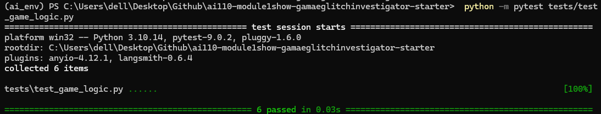
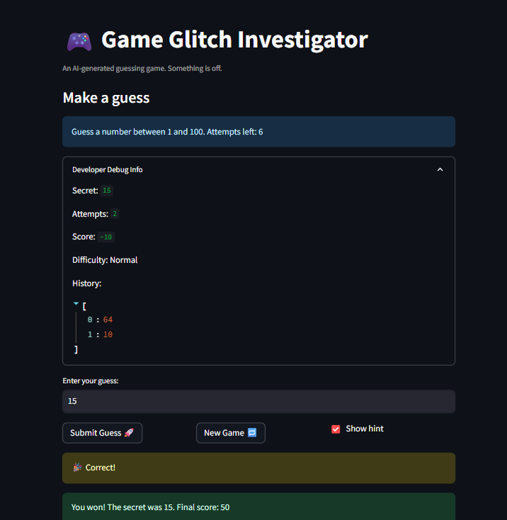

# 🎮 Game Glitch Investigator: The Impossible Guesser

## 🚨 The Situation

You asked an AI to build a simple "Number Guessing Game" using Streamlit.
It wrote the code, ran away, and now the game is unplayable. 

- You can't win.
- The hints lie to you.
- The secret number seems to have commitment issues.

## 🛠️ Setup

1. Install dependencies: `pip install -r requirements.txt`
2. Run the broken app: `python -m streamlit run app.py`

## 🕵️‍♂️ Your Mission

1. **Play the game.** Open the "Developer Debug Info" tab in the app to see the secret number. Try to win.
2. **Find the State Bug.** Why does the secret number change every time you click "Submit"? Ask ChatGPT: *"How do I keep a variable from resetting in Streamlit when I click a button?"*
3. **Fix the Logic.** The hints ("Higher/Lower") are wrong. Fix them.
4. **Refactor & Test.** - Move the logic into `logic_utils.py`.
   - Run `pytest` in your terminal.
   - Keep fixing until all tests pass!

use for pytest - `python -m pytest tests/test_game_logic.py`

## 📝 Document Your Experience

- [x] Describe the game's purpose.
  The game is a number guessing app built with Streamlit where the player tries to guess a randomly chosen secret number within a limited number of attempts, receiving higher or lower hints after each guess.
- [x] Detail which bugs you found.
  The hint messages were reversed (saying "Go HIGHER" when the guess was too high). Hard mode used a range of 1 to 50 which was easier than Normal mode's 1 to 100. The info banner was hardcoded to say "between 1 and 100" regardless of difficulty. Every even numbered attempt converted the secret to a string causing a TypeError crash. The New Game button did not reset status, score, or history so the game stayed stuck after winning or losing.
- [x] Explain what fixes you applied.
  Swapped the hint messages in check_guess so "Too High" says "Go LOWER" and vice versa. Changed Hard mode range to 1 to 200. Removed the buggy even attempt string conversion so the secret is always passed as an integer. Fixed the New Game button to fully reset all session state including status, score, history, and attempts. Refactored all game logic from app.py into logic_utils.py.

## 📸 Demo

- [ ] [Insert a screenshot of your fixed, winning game here]

## 🚀 Stretch Features

- [ ] [If you choose to complete Challenge 4, insert a screenshot of your Enhanced Game UI here]
